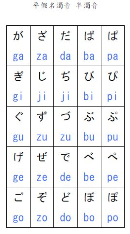
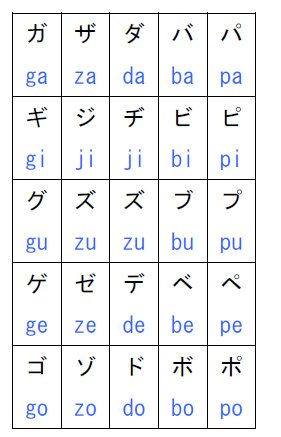

# Les accents
Both the dakuten and the handakuten glyphs are drawn identically in hiragana and katakana scripts.

## Dakuten ゛
The dakuten, colloquially ten-ten, is a diacritic most often used in the Japanese kana syllabaries to indicate that the consonant of a syllable should be pronounced voiced. They look like two small diagonal marks ゛on the top right of the kana. It's used to turn K-S-T-H into G-Z-D-B.

## Handakuten ゜
The handakuten, colloquially maru (circle), is a diacritic used with the kana for syllables starting with h to indicate that they should instead be pronounced with p. 

## Hiragana Table

## Katakana Table
