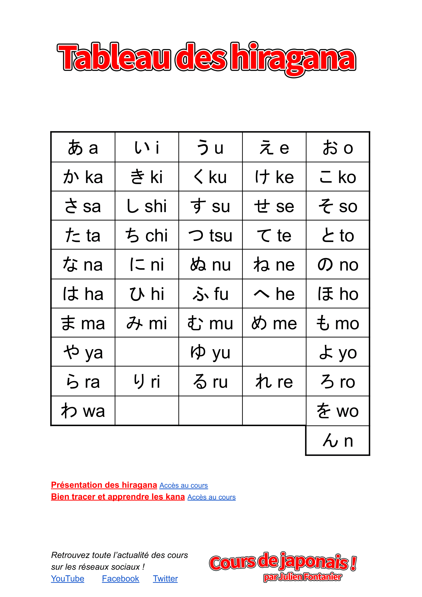
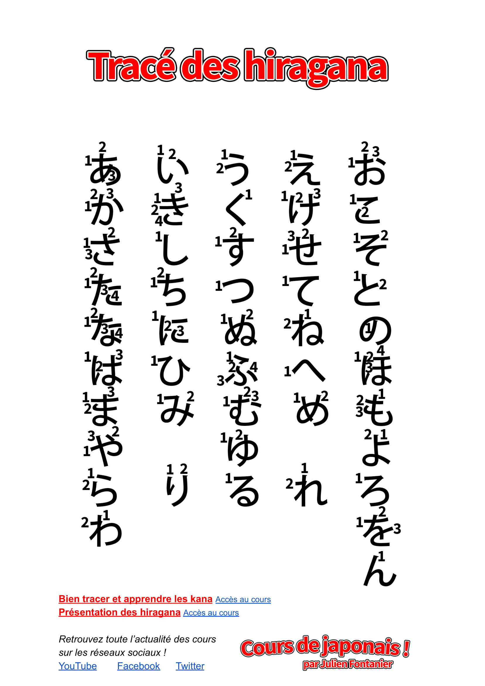

# Hiragana
Hiragana emerged as a manual simplification via cursive script of the
most phonetically widespread kanji among those who could read and write
during the Heian period (794-1185). The main creators of the current
hiragana were ladies of the Japanese imperial court, that used the script
in the writing of personnal communications and literature.

## Table

## Tracing

 
## Source

[Table by Julien Fontanier](https://docs.google.com/document/d/1DTRnivYXJbEoPLg3SUkTVrPIEUBBXukg7ZEbm1hpVsc/edit) / 
[PDF version](./hiragana/tableau-des-hiragana.pdf)  
[Tracing by Julien Fontanier](https://docs.google.com/document/d/1J4qKmTI7MnZ1b49aTty9Z9AQzoAX6ZtlBztSPbq49As/edit) / 
[PDF version](./hiragana/trace-des-hiraganas.pdf)  

