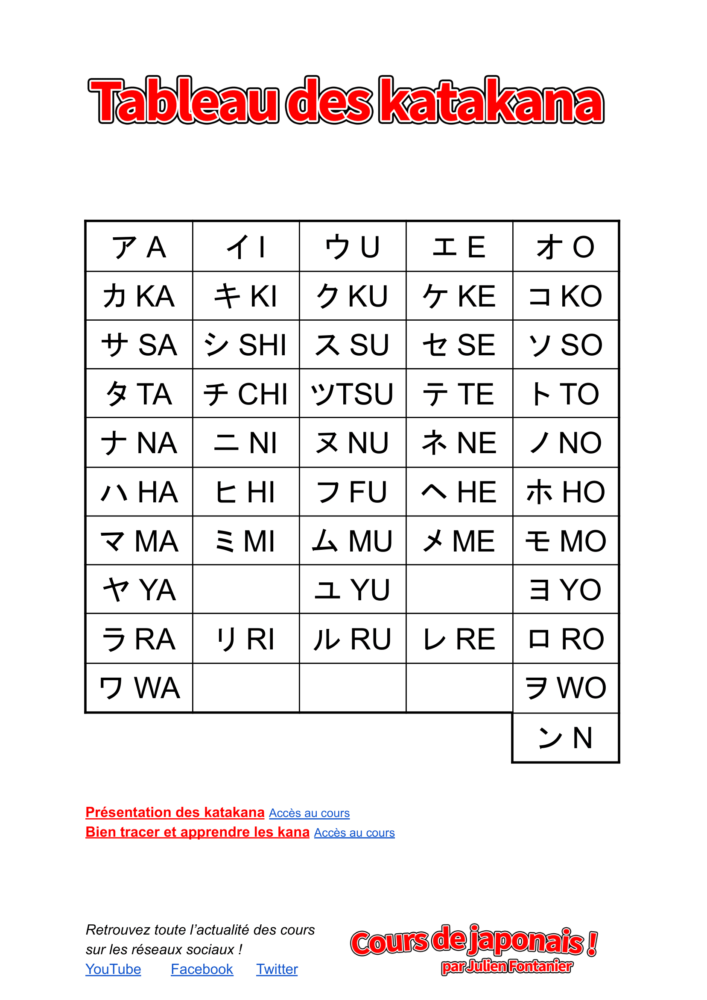
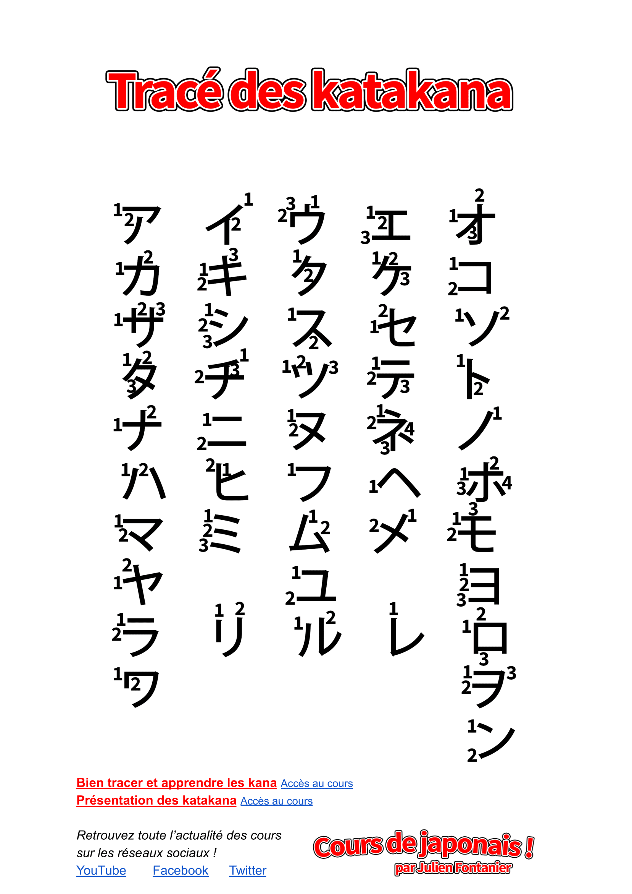

# Katakana
Katakana emerged around the 9th century, in the Heian period, when Buddhist monks
created a syllabary derived from Chinese characters to simplify their reading, using
portions of the characters as a kind of shorthand.

## Table

## Tracing

 
## Source

[Table by Julien Fontanier](https://docs.google.com/document/d/14OWiFBnmKpz3CENfWkG0xK2TwH1nOVOMppjps9SV2ZA/edit) / 
[PDF version](./katakana/tableau-des-katakana.pdf)  
[Tracing by Julien Fontanier](https://docs.google.com/document/d/1aVrjmUMEUvCuOB3gIhpoXsOTf-tY9FuyODctlhrrkYg/edit) / 
[PDF version](./katakana/trace-des-katakana.pdf)  

