# Premiers kanji

## Animaux

犬 (いぬ - inu - chien)

Click to toggle stroke order of 犬

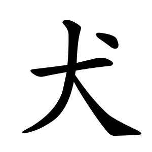 

猫 (ねこ - neko - chat)

Click to toggle stroke order of 猫

 

馬 (うま - uma - cheval)

Click to toggle stroke order of 馬

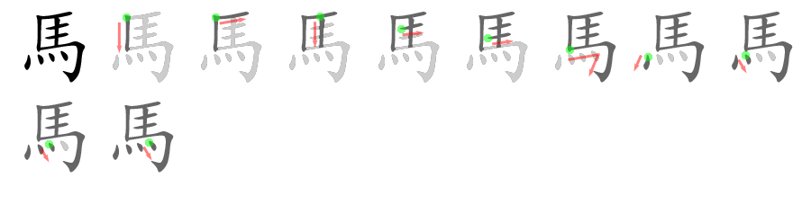 

牛 (うし - ushi - vache)

Click to toggle stroke order of 牛

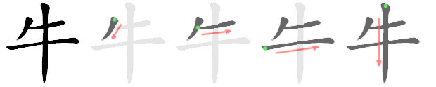 

魚 (さかな - sakana - poisson)

Click to toggle stroke order of 魚

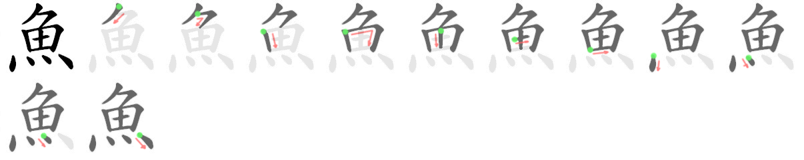 

## Premier mots (Vidéo de Julien Fontanier)

人 (ひと - hito - personne)

Click to toggle stroke order of 人

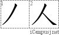 

男 (おとこ - otoko - homme)

Click to toggle stroke order of 男

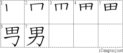 

女 (おんな - onna - femme)

Click to toggle stroke order of 女

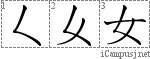 

子 (こ - ko - enfant)

Click to toggle stroke order of 子

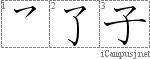 

日 (ひ - hi - soleil)

Click to toggle stroke order of 日

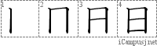 

## Je

私 (わたし - watashi - je)

Click to toggle stroke order of 私

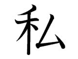 

## Verbes

食べる (たべる - taberu - manger - + deux okurigana)

Click to toggle stroke order of 食

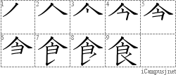 

飲む (のむ - nomu - boire)

Click to toggle stroke order of 飲

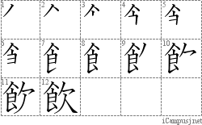 

見る (みる - miru - regarder)

Click to toggle stroke order of 見

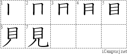 

聞く (きく - kiku - écouter)

Click to toggle stroke order of 見

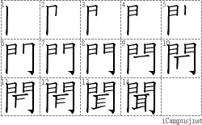 

